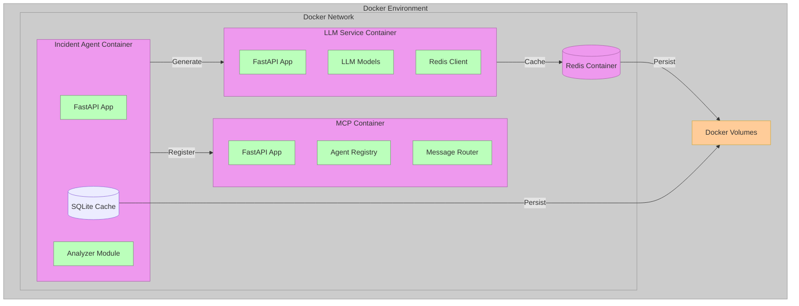

# Docker Deployment Architecture

```mermaid
flowchart TD
    subgraph Docker["Docker Environment"]
        subgraph Net["Docker Network"]
            Redis[(Redis Container)]

            subgraph LLM["LLM Service Container"]
                LLMAPI[FastAPI App]
                Models[LLM Models]
                RedisClient[Redis Client]
            end

            subgraph MCP["MCP Container"]
                MCPAPI[FastAPI App]
                Registry[Agent Registry]
                Router[Message Router]
            end

            subgraph IAA["Incident Agent Container"]
                IAAAPI[FastAPI App]
                Analyzer[Analyzer Module]
                SQLite[(SQLite Cache)]
            end
        end

        Volumes[Docker Volumes]
    end

    LLM -- Cache --> Redis
    IAA -- Register --> MCP
    IAA -- Generate --> LLM

    Redis -- Persist --> Volumes
    SQLite -- Persist --> Volumes

    classDef container fill:#e9e,stroke:#a6a
    classDef volume fill:#fc9,stroke:#ca4
    classDef component fill:#bfb,stroke:#797
    classDef network fill:#ccc,stroke:#999

    class Redis,LLM,MCP,IAA container
    class Volumes volume
    class LLMAPI,Models,RedisClient,MCPAPI,Registry,Router,IAAAPI,Analyzer component
    class Net,Docker network
``` 