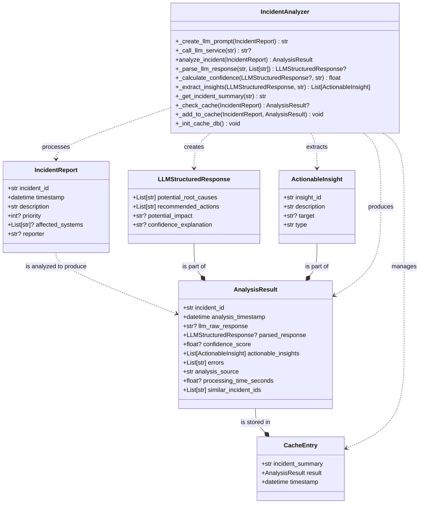

# Incident Analysis Agent Class Diagram

```mermaid
classDiagram
    class IncidentReport {
        +str incident_id
        +datetime timestamp
        +str description
        +int? priority
        +List[str]? affected_systems
        +str? reporter
    }

    class LLMStructuredResponse {
        +List[str] potential_root_causes
        +List[str] recommended_actions
        +str? potential_impact
        +str? confidence_explanation
    }

    class ActionableInsight {
        +str insight_id
        +str description
        +str? target
        +str type
    }

    class AnalysisResult {
        +str incident_id
        +datetime analysis_timestamp
        +str? llm_raw_response
        +LLMStructuredResponse? parsed_response
        +float? confidence_score
        +List[ActionableInsight] actionable_insights
        +List[str] errors
        +str analysis_source
        +float? processing_time_seconds
        +List[str] similar_incident_ids
    }

    class CacheEntry {
        +str incident_summary
        +AnalysisResult result
        +datetime timestamp
    }

    class IncidentAnalyzer {
        +_create_llm_prompt(IncidentReport) str
        +_call_llm_service(str) str?
        +analyze_incident(IncidentReport) AnalysisResult
        +_parse_llm_response(str, List[str]) LLMStructuredResponse?
        +_calculate_confidence(LLMStructuredResponse?, str) float
        +_extract_insights(LLMStructuredResponse, str) List[ActionableInsight]
        +_get_incident_summary(str) str
        +_check_cache(IncidentReport) AnalysisResult?
        +_add_to_cache(IncidentReport, AnalysisResult) void
        +_init_cache_db() void
    }

    IncidentReport ..> AnalysisResult : is analyzed to produce
    LLMStructuredResponse --* AnalysisResult : is part of
    ActionableInsight --* AnalysisResult : is part of
    AnalysisResult --* CacheEntry : is stored in
    IncidentAnalyzer ..> IncidentReport : processes
    IncidentAnalyzer ..> AnalysisResult : produces
    IncidentAnalyzer ..> LLMStructuredResponse : creates
    IncidentAnalyzer ..> ActionableInsight : extracts
    IncidentAnalyzer ..> CacheEntry : manages
``` 