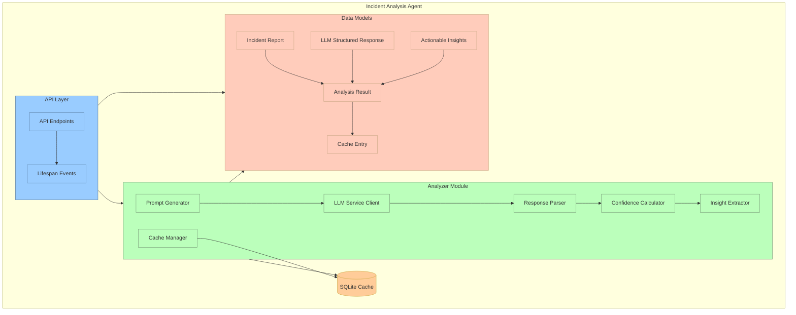

# Incident Analysis Component

```mermaid
flowchart TD
    subgraph IAA["Incident Analysis Agent"]
        API[FastAPI Application]
        Analyzer[Analyzer Module]
        Models[Pydantic Models]
        Cache[(SQLite Cache)]

        subgraph API["API Layer"]
            Endpoints[API Endpoints]
            Lifespan[Lifespan Events]
        end

        subgraph Analyzer["Analyzer Module"]
            PromptGen[Prompt Generator]
            LLMCaller[LLM Service Client]
            ResponseParser[Response Parser]
            ConfCalc[Confidence Calculator]
            InsightExtractor[Insight Extractor]
            CacheManager[Cache Manager]
        end

        subgraph Models["Data Models"]
            IncidentReport[Incident Report]
            AnalysisResult[Analysis Result]
            LLMResponse[LLM Structured Response]
            Insights[Actionable Insights]
            CacheEntry[Cache Entry]
        end
    end

    API --> Analyzer
    API --> Models
    Analyzer --> Models
    Analyzer --> Cache

    Endpoints --> Lifespan

    PromptGen --> LLMCaller
    LLMCaller --> ResponseParser
    ResponseParser --> ConfCalc
    ConfCalc --> InsightExtractor
    CacheManager --> Cache

    IncidentReport --> AnalysisResult
    LLMResponse --> AnalysisResult
    Insights --> AnalysisResult
    AnalysisResult --> CacheEntry

    classDef api fill:#9cf,stroke:#579
    classDef analyzer fill:#bfb,stroke:#797
    classDef models fill:#fcb,stroke:#ca8
    classDef database fill:#fc9,stroke:#ca4

    class API,Endpoints,Lifespan api
    class Analyzer,PromptGen,LLMCaller,ResponseParser,ConfCalc,InsightExtractor,CacheManager analyzer
    class Models,IncidentReport,AnalysisResult,LLMResponse,Insights,CacheEntry models
    class Cache database
``` 