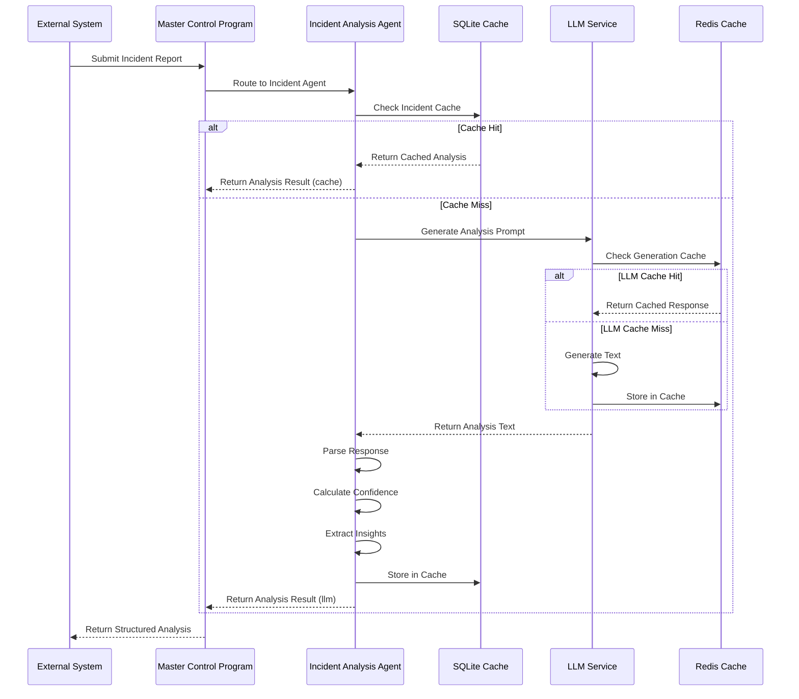

# Incident Analysis Sequence

```mermaid
sequenceDiagram
    participant External as External System
    participant MCP as Master Control Program
    participant IAA as Incident Analysis Agent
    participant DB as SQLite Cache
    participant LLM as LLM Service
    participant Redis as Redis Cache

    External->>MCP: Submit Incident Report
    MCP->>IAA: Route to Incident Agent

    IAA->>DB: Check Incident Cache

    alt Cache Hit
        DB-->>IAA: Return Cached Analysis
        IAA-->>MCP: Return Analysis Result (cache)
    else Cache Miss
        IAA->>LLM: Generate Analysis Prompt

        LLM->>Redis: Check Generation Cache

        alt LLM Cache Hit
            Redis-->>LLM: Return Cached Response
        else LLM Cache Miss
            LLM->>LLM: Generate Text
            LLM->>Redis: Store in Cache
        end

        LLM-->>IAA: Return Analysis Text
        IAA->>IAA: Parse Response
        IAA->>IAA: Calculate Confidence
        IAA->>IAA: Extract Insights
        IAA->>DB: Store in Cache
        IAA-->>MCP: Return Analysis Result (llm)
    end

    MCP-->>External: Return Structured Analysis
``` 