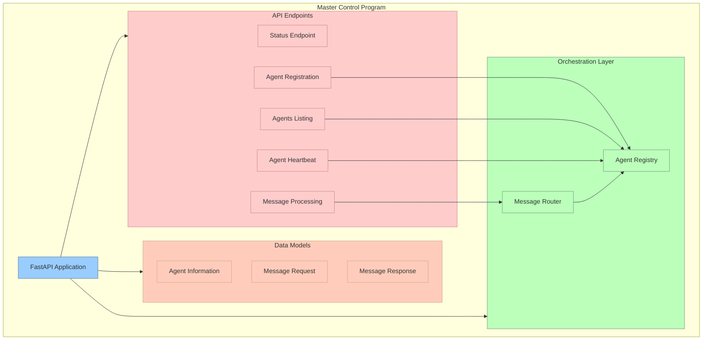

# Master Control Program Architecture

```mermaid
flowchart TD
    subgraph MCP["Master Control Program"]
        API[FastAPI Application]

        subgraph Orchestration["Orchestration Layer"]
            Registry[Agent Registry]
            Router[Message Router]
        end

        subgraph Models["Data Models"]
            AgentInfo[Agent Information]
            MessageRequest[Message Request]
            MessageResponse[Message Response]
        end

        subgraph Endpoints["API Endpoints"]
            StatusEP[Status Endpoint]
            RegisterEP[Agent Registration]
            AgentsListEP[Agents Listing]
            MessageEP[Message Processing]
            HeartbeatEP[Agent Heartbeat]
        end
    end

    API --> Orchestration
    API --> Models
    API --> Endpoints

    RegisterEP --> Registry
    AgentsListEP --> Registry
    MessageEP --> Router
    HeartbeatEP --> Registry

    Router --> Registry

    classDef api fill:#9cf,stroke:#579
    classDef orchestration fill:#bfb,stroke:#797
    classDef models fill:#fcb,stroke:#ca8
    classDef endpoints fill:#fcc,stroke:#c88

    class API api
    class Orchestration,Registry,Router orchestration
    class Models,AgentInfo,MessageRequest,MessageResponse models
    class Endpoints,StatusEP,RegisterEP,AgentsListEP,MessageEP,HeartbeatEP endpoints
``` 