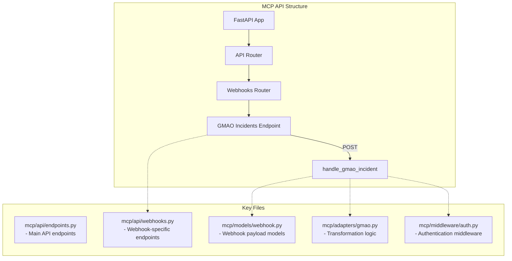

# Webhook API Structure and Key Files

This diagram outlines a potential project structure for implementing the webhook endpoint within the MCP, highlighting key files and their roles.

**Note:** This diagram suggests a possible refactoring where webhook-specific logic (`mcp/api/webhooks.py`), transformation (`mcp/adapters/gmao.py`), and authentication (`mcp/middleware/auth.py`) are moved to their own modules for better organization as the MCP grows. The current implementation places most of this logic within `mcp/api/endpoints.py`. 