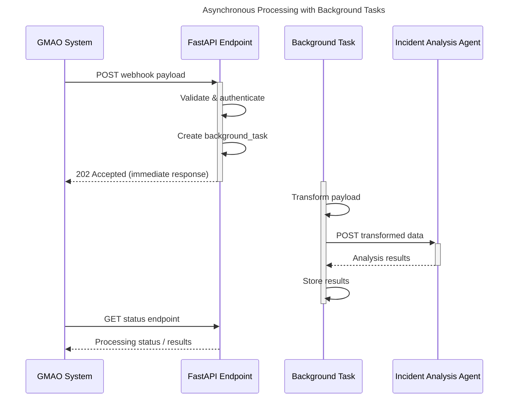

# Asynchronous Processing with Background Tasks

This sequence diagram illustrates how FastAPI's background tasks can be used for asynchronous processing of webhook data after the initial acknowledgment.

