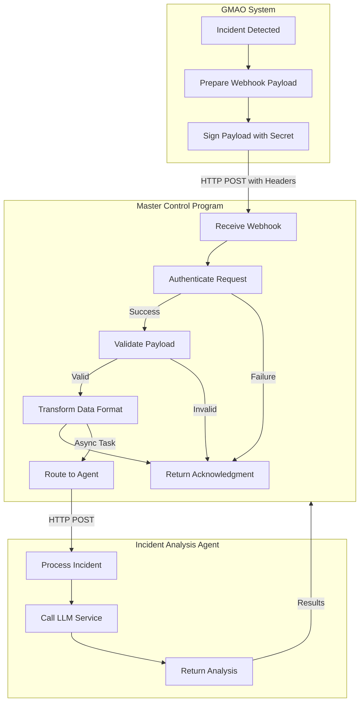

# Webhook Component Data Flow

This diagram shows the component interactions and data flow for the webhook integration.

```mermaid
flowchart TD
    subgraph GMAO["GMAO System"]
        G_INC[Incident Detected]
        G_PREP[Prepare Webhook Payload]
        G_SIGN[Sign Payload with Secret]
    end
    
    subgraph MCP["Master Control Program"]
        M_RECV[Receive Webhook]
        M_AUTH[Authenticate Request]
        M_VAL[Validate Payload]
        M_TRANS[Transform Data Format]
        M_ROUTE[Route to Agent]
        M_RESP[Return Acknowledgment]
    end
    
    subgraph IAA["Incident Analysis Agent"]
        I_PROC[Process Incident]
        I_LLM[Call LLM Service]
        I_RET[Return Analysis]
    end
    
    G_INC --> G_PREP
    G_PREP --> G_SIGN
    G_SIGN --> |HTTP POST with Headers|M_RECV
    
    M_RECV --> M_AUTH
    M_AUTH --> |Success|M_VAL
    M_AUTH --> |Failure|M_RESP
    M_VAL --> |Valid|M_TRANS
    M_VAL --> |Invalid|M_RESP
    
    M_TRANS --> M_RESP
    M_TRANS --> |Async Task|M_ROUTE
    
    M_ROUTE --> |HTTP POST|I_PROC
    
    I_PROC --> I_LLM
    I_LLM --> I_RET
    I_RET --> |Results|MCP

    class GMAO fill:#f9d,stroke:#333
    class MCP fill:#9df,stroke:#333
    class IAA fill:#ad9,stroke:#333
``` 