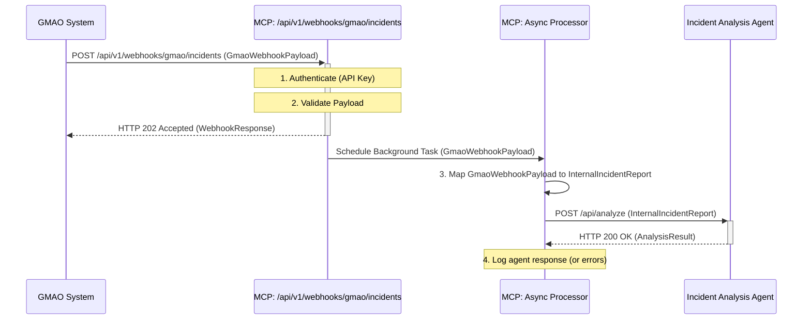

# Webhook Data Flow

This diagram illustrates the overall data flow when an incident is reported via the GMAO webhook.



**Explanation:**

1.  The **GMAO System** sends an incident payload via a POST request to the MCP's webhook endpoint.
2.  The **MCP Webhook Endpoint** immediately:
    *   Authenticates the request (e.g., using an API key).
    *   Validates the incoming `GmaoWebhookPayload`.
    *   Responds with HTTP `202 Accepted` to acknowledge receipt.
    *   Schedules a background task for further processing.
3.  The **MCP Async Processor** (running as a background task):
    *   Maps the `GmaoWebhookPayload` to the internal `InternalIncidentReport` format.
    *   Sends the `InternalIncidentReport` to the **Incident Analysis Agent**'s `/analyze` endpoint.
4.  The **Incident Analysis Agent** processes the report and returns the analysis.
5.  The MCP Async Processor logs the outcome.

**b. Authentication Mechanisms**

We'll illustrate both API Key (as implemented for now) and HMAC (as a more robust best practice).

File: `docs/architecture/diagrams/webhook-authentication.md`
```markdown
# Webhook Authentication Mechanisms

## 1. API Key Authentication (Current Implementation)

This diagram shows the simple API Key authentication flow used by the webhook.

```mermaid
sequenceDiagram
    participant GMAO_System as GMAO System
    participant MCP_Webhook as MCP: Webhook Endpoint
    participant MCP_Auth_Logic as MCP: Auth Logic (verify_api_key)

    GMAO_System->>+MCP_Webhook: POST /webhook (Payload, Headers[X-GMAO-Token])
    MCP_Webhook->>+MCP_Auth_Logic: Verify Token (X-GMAO-Token)
    Note over MCP_Auth_Logic: Compare received token with stored GMAO_WEBHOOK_API_KEY
    alt Token Valid
        MCP_Auth_Logic-->>-MCP_Webhook: Authentication Success
        MCP_Webhook-->>GMAO_System: HTTP 202 Accepted
    else Token Invalid or Missing
        MCP_Auth_Logic-->>-MCP_Webhook: Authentication Failure
        MCP_Webhook-->>GMAO_System: HTTP 401/403 Unauthorized/Forbidden
    end
```

## 2. HMAC Signature Verification (Recommended Best Practice)

This diagram illustrates the more secure HMAC signature verification flow.

```mermaid
sequenceDiagram
    participant GMAO_System as GMAO System
    participant MCP_Webhook as MCP: Webhook Endpoint
    participant MCP_Auth_Logic as MCP: HMAC Verification Logic

    GMAO_System->>GMAO_System: 1. Create Payload
    GMAO_System->>GMAO_System: 2. Generate HMAC Signature (payload, shared_secret)
    GMAO_System->>+MCP_Webhook: POST /webhook (Payload, Headers[X-GMAO-Signature])

    MCP_Webhook->>+MCP_Auth_Logic: Verify Signature (Payload, X-GMAO-Signature)
    MCP_Auth_Logic->>MCP_Auth_Logic: 1. Retrieve Shared Secret
    MCP_Auth_Logic->>MCP_Auth_Logic: 2. Recalculate HMAC Signature (Payload, shared_secret)
    Note over MCP_Auth_Logic: Compare received signature with recalculated signature
    alt Signatures Match
        MCP_Auth_Logic-->>-MCP_Webhook: Authentication Success (Integrity Verified)
        MCP_Webhook-->>GMAO_System: HTTP 202 Accepted
    else Signatures Do Not Match
        MCP_Auth_Logic-->>-MCP_Webhook: Authentication Failure
        MCP_Webhook-->>GMAO_System: HTTP 403 Forbidden (Invalid Signature)
    end
```

**c. Data Transformation Process**

File: `docs/architecture/diagrams/webhook-data-transformation.md`
```markdown
# Webhook Data Transformation

This diagram illustrates the process of mapping the incoming `GmaoWebhookPayload` to the internal `InternalIncidentReport` format within the MCP.

```mermaid
graph LR
    subgraph GMAO System
        direction LR
        GMAO_Payload[GmaoWebhookPayload JSON<br><br>external_incident_id<br>event_timestamp<br>title<br>description<br>priority_name (e.g., "High")<br>affected_services<br>reported_by<br>gmao_link<br>additional_data]
    end

    subgraph MCP [Master Control Program]
        direction TB
        WebhookEndpoint["/api/v1/webhooks/gmao/incidents"]
        MappingFunction["map_gmao_to_internal_incident()"]
        InternalModel[InternalIncidentReport<br><br>incident_id<br>timestamp<br>description (combined)<br>priority (e.g., 2)<br>affected_systems<br>reporter]

        WebhookEndpoint -- Receives --> GMAO_Payload
        WebhookEndpoint -- Calls with GmaoWebhookPayload --> MappingFunction
        MappingFunction -- Transforms Data --> InternalModel
        MappingFunction -- Returns InternalIncidentReport --> WebhookEndpoint
        InternalModel -. Used by .-> AsyncProcessor["Async Processor<br>forward_incident_to_agent()"]

        style GMAO_Payload fill:#f9f,stroke:#333,stroke-width:2px
        style InternalModel fill:#ccf,stroke:#333,stroke-width:2px
        style MappingFunction fill:#lightgrey,stroke:#333,stroke-width:2px
    end
    
    AsyncProcessor --> IncidentAnalysisAgent["Incident Analysis Agent<br>(Expects InternalIncidentReport)"]


    note right of MappingFunction
        Mapping Logic Examples:
        - Concatenate `title` and `description`
        - Convert `priority_name` string (e.g., "High") to integer (`2`)
        - Append `gmao_link` and `additional_data` to description
        - Direct field copies (e.g., `event_timestamp` to `timestamp`)
    end
```

**Summary of Files to Create/Modify:**

1.  **New File:** `mcp/models/webhook.py` (Code provided and applied)
2.  **Modify File:** `mcp/api/endpoints.py` (Code provided and applied)
3.  **New File:** `docs/architecture/diagrams/webhook-data-flow.md` (Mermaid syntax provided)
4.  **New File:** `docs/architecture/diagrams/webhook-authentication.md` (Mermaid syntax provided)
5.  **New File:** `docs/architecture/diagrams/webhook-data-transformation.md` (Mermaid syntax provided)

Remember to review the TODOs and important next steps mentioned for the `mcp/api/endpoints.py` file, especially around configuration, the exact internal incident model, and error handling for the agent communication.