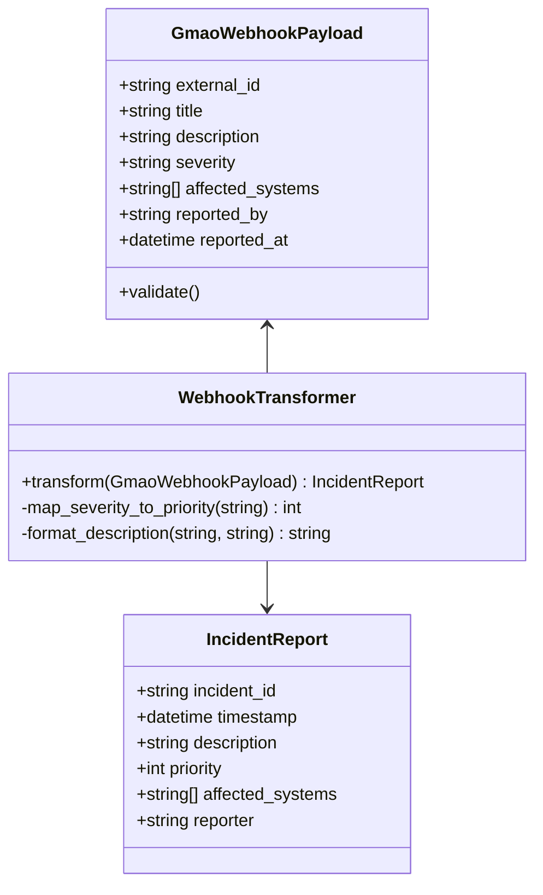

# Webhook Data Transformation Models

This class diagram shows the key Pydantic models involved in transforming the incoming GMAO webhook payload to the internal `IncidentReport` format.

```mermaid
classDiagram
    class GmaoWebhookPayload {
        +string external_id
        +string title
        +string description
        +string severity
        +string[] affected_systems
        +string reported_by
        +datetime reported_at
        +validate()
    }
    
    class IncidentReport {
        +string incident_id
        +datetime timestamp
        +string description
        +int priority
        +string[] affected_systems
        +string reporter
    }
    
    class WebhookTransformer {
        +transform(GmaoWebhookPayload) IncidentReport
        -map_severity_to_priority(string) int
        -format_description(string, string) string
    }
    
    GmaoWebhookPayload <-- WebhookTransformer
    WebhookTransformer --> IncidentReport
``` 