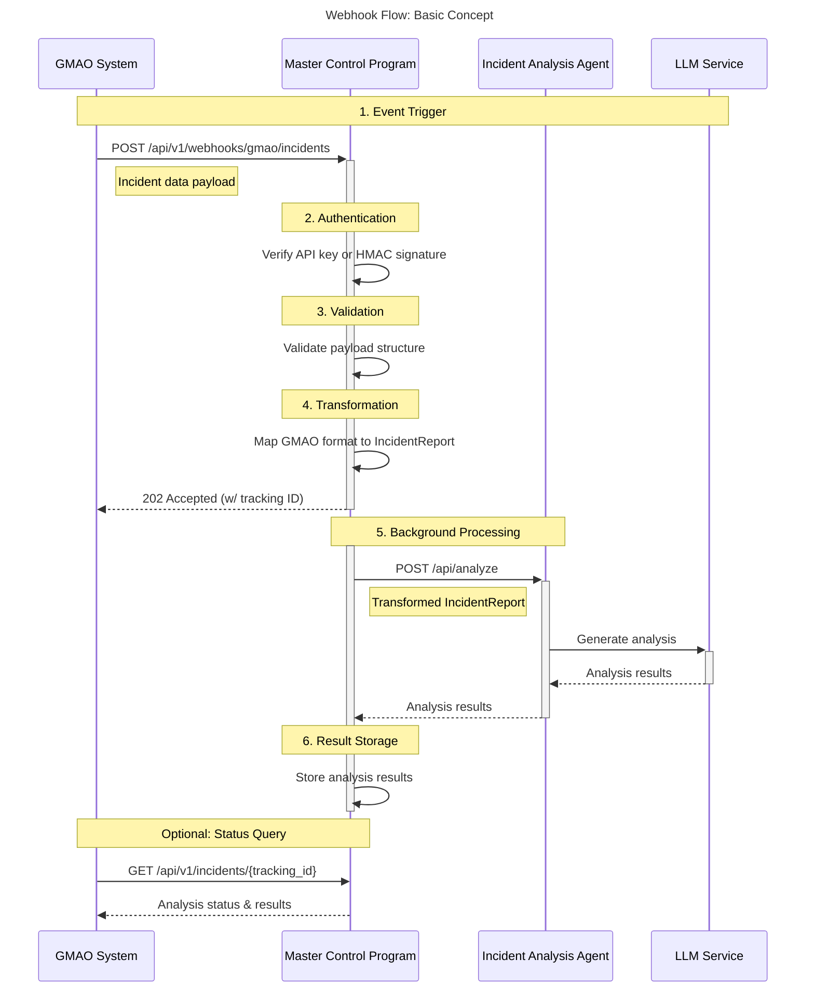

# Webhook Flow: Basic Concept

This diagram illustrates the high-level sequence of events and interactions when an incident is reported via the GMAO webhook.

```mermaid
sequenceDiagram
    title Webhook Flow: Basic Concept
    
    participant GMAO as GMAO System
    participant MCP as Master Control Program
    participant IAA as Incident Analysis Agent
    participant LLM as LLM Service
    
    Note over GMAO,LLM: 1. Event Trigger
    GMAO->>+MCP: POST /api/v1/webhooks/gmao/incidents
    Note right of GMAO: Incident data payload
    
    Note over MCP: 2. Authentication
    MCP->>MCP: Verify API key or HMAC signature
    
    Note over MCP: 3. Validation
    MCP->>MCP: Validate payload structure
    
    Note over MCP: 4. Transformation
    MCP->>MCP: Map GMAO format to IncidentReport
    
    MCP-->>GMAO: 202 Accepted (w/ tracking ID)
    deactivate MCP
    
    Note over MCP,IAA: 5. Background Processing
    activate MCP
    MCP->>+IAA: POST /api/analyze
    Note right of MCP: Transformed IncidentReport
    
    IAA->>+LLM: Generate analysis
    LLM-->>-IAA: Analysis results
    
    IAA-->>-MCP: Analysis results
    
    Note over MCP: 6. Result Storage
    MCP->>MCP: Store analysis results
    deactivate MCP
    
    Note over GMAO,MCP: Optional: Status Query
    GMAO->>MCP: GET /api/v1/incidents/{tracking_id}
    MCP-->>GMAO: Analysis status & results
``` 