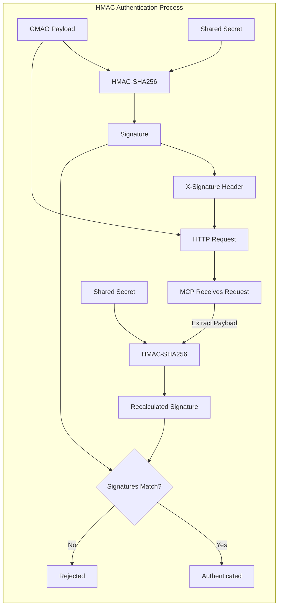

# HMAC Authentication Process

This diagram details the steps involved in HMAC-SHA256 signature generation by the sender (GMAO) and verification by the receiver (MCP).

```mermaid
flowchart LR
    subgraph HMAC["HMAC Authentication Process"]
        direction TB
        
        GP[GMAO Payload]
        HS1[HMAC-SHA256]
        SIG1[Signature]
        
        GP --> HS1
        SS1[Shared Secret] --> HS1
        HS1 --> SIG1
        
        REQ[HTTP Request]
        HEAD[X-Signature Header]
        
        GP --> REQ
        SIG1 --> HEAD
        HEAD --> REQ
        
        MCP[MCP Receives Request]
        HS2[HMAC-SHA256]
        SIG2[Recalculated Signature]
        
        REQ --> MCP
        MCP --> |Extract Payload| HS2
        SS2[Shared Secret] --> HS2
        HS2 --> SIG2
        
        COMP{Signatures Match?}
        AUTH[Authenticated]
        REJECT[Rejected]
        
        SIG1 --> COMP
        SIG2 --> COMP
        COMP -->|Yes| AUTH
        COMP -->|No| REJECT
    end
    
    class HMAC fill:#fff,stroke:#333
    class COMP fill:#ff9,stroke:#333
    class AUTH fill:#9f9,stroke:#333
    class REJECT fill:#f99,stroke:#333
``` 